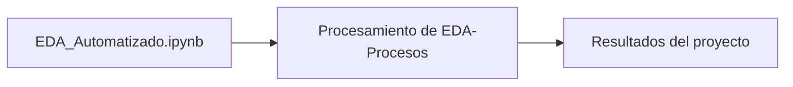

# Eda-Automatizado

## Descripción

Script creado en python para automatizar el proceso de analisis de datos

## Diagrama

[Explorar la arquitectura interactiva en GitDiagram](https://gitdiagram.com/HoracioLaphitz/EDA-Procesos)

